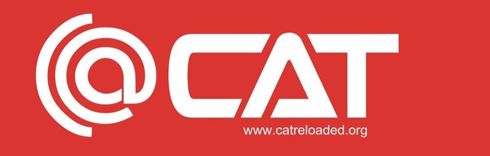
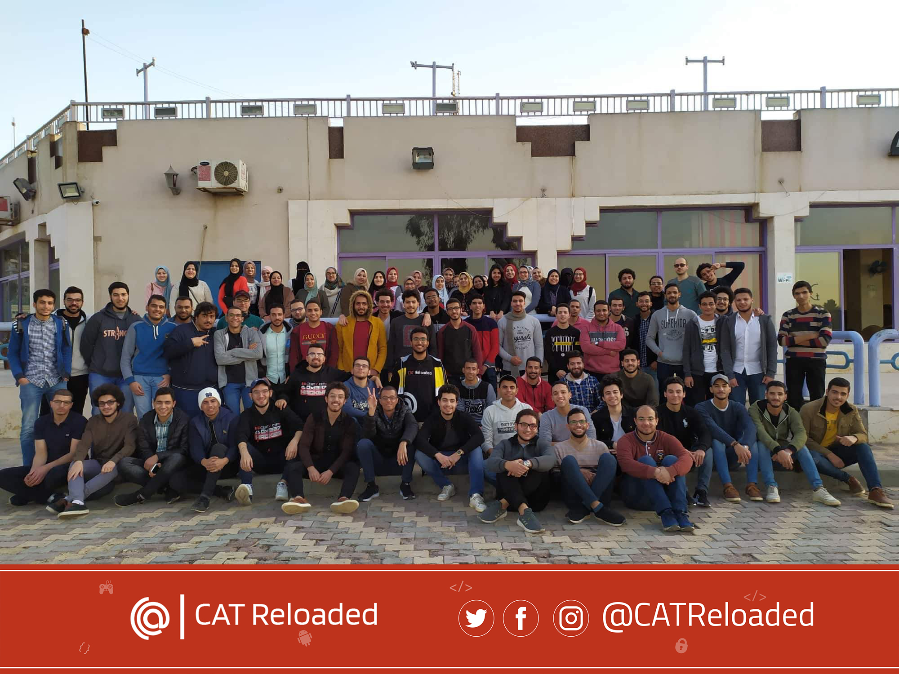

# CAT-Reloaded-Computer-Sciense-Cirlcle-Road-Map

|  📚 Content |
| :------------: |
|  [Computer science circle](#computer-science-circle) |
|[Our Mentor](#technical-mentor "Our Mentor")|
| [CAT Reloaded](#cat-reloaded "CAT Reloaded")  |
|  [Before start](#before-start-you-should-know "Before start") |
| [Roadmap](#here-we-go-)  |
|[Finally](#Finally "Finally")|

-------------

## Computer science circle
📌 we are one of many circles at [CAT-Reloaded](https://github.com/0oM4R/CAT-CS-Road_map#cat-reloaded), We are focusing on CS fundamentals.

I'm the circle leader and I have great people supervising the members in our circle. 

feel free to contact us!

[Omar Kassem](https://www.linkedin.com/in/omar-kassem/ "Omar Kassem"), [Mohamed Elkhamisy](https://www.linkedin.com/in/elkhamisi/ "Mohamed Elkhamisy"), [Mohamed Magdi](https://www.linkedin.com/in/muhamedmagdi/ "Mohamed Magdi"), [Waleed Negm](https://www.linkedin.com/in/waleed-negm/ "Waleed Negm"), and [Hoassam Assad](https://www.linkedin.com/in/hossamasaad10/ "Hoassam Assad") 

--------------

# Technical Mentor

## 👑 [Omar Elawady](https://www.linkedin.com/in/omar-elawady-96b1ab139/ "Omar Elawady")

-------------

## [CAT Reloaded](https://www.facebook.com/CATReloaded "CAT Reloaded")

------------

▶ What is [CAT Reloaded](https://www.facebook.com/CATReloaded "CAT Reloaded")?

📌 [CAT Reloaded](https://www.facebook.com/CATReloaded "CAT Reloaded") Abbreviation for **C**omputer **A**ssistance **T**eam was from **1996** and reloaded again so it gained its name **CAT Reloaded** from this matter.

------------

▶ What do we do in [CAT Reloaded](https://www.facebook.com/CATReloaded "CAT Reloaded")?

📌 The team is interested in forming technical circles in order to form communities that help and participate in learning modern software technology such as: **Computer science**, **Cyber Security**, **Gaming**, **Web Development**, **Mobile Development**, **Data Science**, **Embedded system** and **Graphic Design**.

------------

▶ How can you follow us on social media or offline?

📌 [CAT Reloaded](https://www.facebook.com/CATReloaded "CAT Reloaded") community in Mansoura, you know more about us and our activities through our social media:

💻[Web site](http://catreloaded.org/ "Web site")

💻[GitHub](https://github.com/CATReloaded "Web site")

📱 [Facebook Page](https://www.facebook.com/pg/CATReloaded "Facebook Page")

📱 [Facebook Group](https://www.facebook.com/groups/catreloaded.team "Facebook Group")

📱 [Twitter](https://twitter.com/CATReloaded "Twitter")

📱 [Linkedin](https://www.linkedin.com/company/cat-reloaded/ "Linkedin")

👓[YouTube](https://www.youtube.com/user/C4TReloaded "YouTube")

------------

▶ How to be a member of CAT Reloaded?

📌 Almost every year we host a recruitment [Event](https://www.facebook.com/events/375956410319681/?active_tab=discussion "Event") in Mansoura University to attract all of the interested students in Computer Science in general, categorizing them in Circles meant for different fields.

------------

## Before start, You should know:

----------- 
▶ Who is this road map for? 

📌 This road map is for anyone who: 
- Needs to start in the Computer Science field. 
- Already started in technology and needs to rebuild his/her knowledge with basics.

-----------
▶  So Why “Computer Science Fundmentals”?

📌**If you need to climb stairs, you must tread the first stair.**

The CS fundamentals are the first stair in CS stairs, It will help you to understand how the computer works, how to deal with data, how to deal with code and many other things you should know to go freely on your career. Whatever the CS technology you choose to learn, you need these fundamentals. 
Many people who decided to start directly learning one of CS technology are suffering from a lack of some skills and information and they waste their times to go back and learn what they need and the process is repeated continuously.

------------

▶ What do we need to start?

📌 Just take the decision to learn, and go ahead!
> **You do not need any requirements to start, you only need Passion, Power, patience and Persistence**

------------

▶ What is a good resource to study?

📌 You should know that the computer science field is not easy or clear and it takes time, one of the reasons is there are many resources, this makes many of us dispersed.
So remember there is no clear path to you or path from 0 to hero.

📌We make an effort to make our paths in this field. We are trying to make it easier by taking advice, good resources, how to study smart, and be in touch with new technologies from other mentors.

>And here we put it all in your hand!

-----------

## Here we go !

|   🔎 Roadmap   |
| :------------: |
|[Goal](#road-map-goal- "Goal")|
|[Time commitment](#time-commitment- "Time commitment")|
|[Main topics](#main-topics- "Main topics")|
|[Courses](#courses "Courses")|
|[Timeline](#timeline "Timeline")|

### Road Map Goal :

A lot of newcomers and even those who went directly into applications have issues with delving deeper into topics because of the lack of basics. And that’s why this roadmap was made.

📌 The goal is to learn the basics of computer science using which they can progress in multiple disciplines.

-----------

### Time commitment :

📌 From 6 to 20 hours a week.

It’s mainly directed to students in their first years to be taken alongside their study. That’s why the number of hours might be less than what is expected from a full-time learner.

--------

### Main topics :

The roadmap might be focusing more on the thoertical side, That's because it is the base we'll be building upon when learning any field or any new technology, There’re other circles like (backend, data science, game development, and security) that focus on the practical part.

📌 So here are the topics that should be covered.

	 1.Introduction To Computer Science
	 2.Python And C Language
	 3.Object-Oriented Programming
	 4.Algorithms And Data Structures
	 5.Discrete Mathematics For Computer Science
	 6.Operating Systems
	 7.Networking
	 8.Databases

---------

### Courses

📌 They are based on the plan of [OSSU](https://github.com/ossu/computer-science "OSSU").      They should be taken as is, with their assignments and readings fully completed.

- [Introduction to computer science and programming in python](https://ocw.mit.edu/courses/electrical-engineering-and-computer-science/6-0001-introduction-to-computer-science-and-programming-in-python-fall-2016/index.htm "Introduction to computer science and programming in python")

		- Provide an understanding of the role computation can play in solving problems.
		- General stuff (Branching and Iteration, String Manipulation, Functions, Recursion, Dicts, Exceptions, ...).
		- Intro to OOP.

- [CS50 ](https://www.edx.org/course/cs50s-introduction-to-computer-science "CS50 ")

		- Programming with C (Memory Management).
		- Basic Data Structures and Algorithms in C 
				Sorting and Searching Algorithms, Linked lists, Trees, Hash Table, Queues, Stacks
>The C part only "for now".

- [Mathematics for computer science](https://ocw.mit.edu/courses/electrical-engineering-and-computer-science/6-042j-mathematics-for-computer-science-spring-2015/index.htm "Mathematics for computer science")

		- Proofs to understand algorithms analysis and the language they use for its description
		- Counting and basic probability
		- Some discrete mathematics 

- [Divide and Conquer, Sorting and Searching, and Randomized Algorithms](https://www.coursera.org/learn/algorithms-divide-conquer "Divide and Conquer, Sorting and Searching, and Randomized Algorithms")

- [Graph Search, Shortest Paths, and Data Structures](https://www.coursera.org/learn/algorithms-graphs-data-structures "Graph Search, Shortest Paths, and Data Structures")

- [Databases]()

	- [Relational Databases and SQL ](https://www.edx.org/course/databases-5-sql "-Relational Databases and SQL ")
	- [Databases: Modeling and Theory](https://www.edx.org/course/modeling-and-theory "Databases: Modeling and Theory")
	- [Databases: Semistructured Data ](https://www.edx.org/course/semistructured-data "Databases: Semistructured Data ")

- [ Introduction to Computer Networking ](https://www.youtube.com/playlist?list=PLEAYkSg4uSQ2dr0XO_Nwa5OcdEcaaELSG " Introduction to Computer Networking ")

- [Operating Systems: Three Easy Pieces ](http://pages.cs.wisc.edu/~remzi/Classes/537/Spring2018/ "Operating Systems: Three Easy Pieces ")

----------

### Timeline

|  Course |  Number of hours |
| :------------: | :------------: |
| Introduction to CS | 120  |
| CS50  |  90 |
|  Maths |  65 |
|  Algorithms |   48|
|  Networking | 64  |
|  DB1 |  20 |
|  DB2 and DB3 |  49 |
|  OS |  66 |

---------------

## Finally

**I want to thank everyone who helped me to reach this point and those who keep helping me.**

**I can't express how grateful I'm.**

#### Good luck to everyone!

------------
