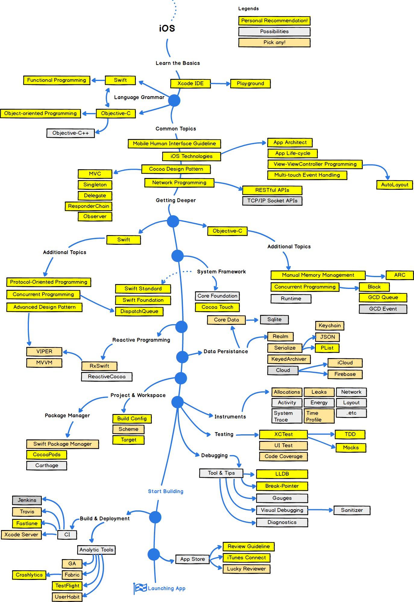

# 🚀 iOS Developer Roadmap 
Roadmap to become an iOS developer .

## ☝️ What is it?
This is a tree-like compilation of topics highly relevant to iOS development.

## ✌️ Who is it for?
The roadmap will be helpul for:

- anyone who wants to become an iOS developer
- iOS developers who are preparing for interviews and need to brush up knowledge
- iOS developers who need to compile own set of interview questions

## 👨‍🎓 How to use this roadmap
1. Find a topic you want to study.
2. Go Google for resources specific for that topic (youtube videos , Medium articles , udemy , etc..).
3. Study until you can confidently explain the topic to your CAT.
4. Go to step 1.

## 🗺 Image version 
Roadmap of essential topics.

## 🗺 Courses-Dependant Learning 
If you like start learning by courses you can find a great content to learn in these Courses :
- [Learning Basic Swift Syntax Crash Course (Devslopes) ](https://www.youtube.com/watch?v=mhE-Mp07RTo) *Note That you need to have a previous knowledge on another programming language to make sure you understand the basic concepts on programming*
- [As a beginner : iOS & Swift - The Complete iOS App Development Bootcamp (Angela Yu) ](https://www.udemy.com/course/ios-13-app-development-bootcamp/)
- [For a beginner also you can depend on : iOS beginner path (Ray Wenderlich) ](https://www.raywenderlich.com/paths#ios)
- [As an intermediate : iOS 11 & Swift 4: From Beginner to Paid Professional™ (Devslopes) ](https://www.udemy.com/course/devslopes-ios11/)
- [As an advanced : CS193p Developing applications for iOS (Stanford university) ](https://youtube.com/playlist?list=PLPA-ayBrweUzGFmkT_W65z64MoGnKRZMq)
- [There is also a newer verssion of 2020 focusing on SwiftUI - CS193p Developing applications for iOS (Stanford university) ](https://youtube.com/playlist?list=PLpGHT1n4-mAtTj9oywMWoBx0dCGd51_yG)

